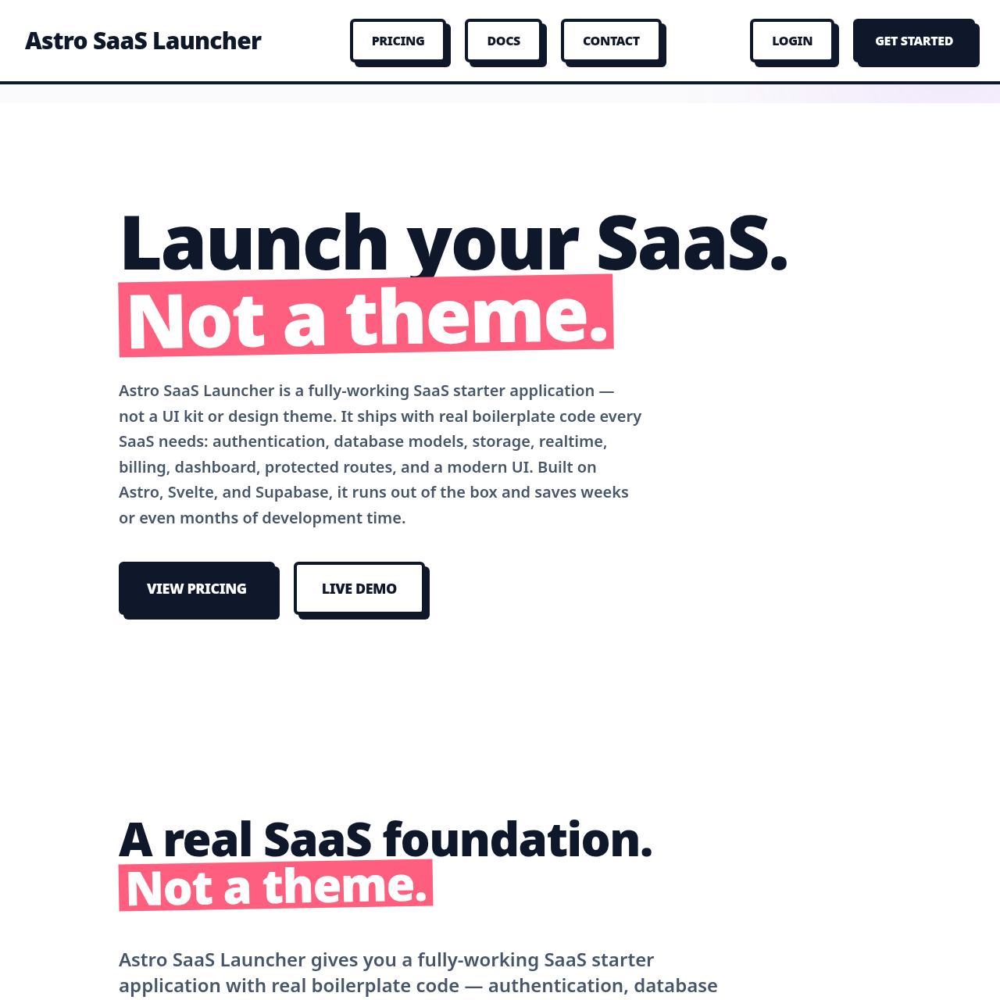

# Astro SaaS Launcher  

  

A fully‑working SaaS application built with Astro, Svelte, Tailwind CSS, and Supabase.

Astro SaaS Launcher is a complete, production‑ready starter designed for developers who want to launch real SaaS products without spending weeks building the same boilerplate. It includes authentication, database models, protected routes, billing, dashboard UI, and a clean, scalable architecture.

This is not a theme.  
This is not a UI kit.  
This is a functioning SaaS application with real logic, real integrations, and a real foundation you can build on.

---

## What Makes Astro SaaS Launcher Different

Most “SaaS starters” are just designs. They look good, but they don’t work. They leave you to wire up authentication, database schemas, billing, routing, dashboards, and deployment pipelines on your own.

Astro SaaS Launcher gives you all of that out of the box.

You get:

- Authentication already implemented  
- Database schema already created  
- Protected routes already wired  
- Dashboard already built  
- Billing already integrated  
- File structure already organised  
- UI components already functional  

You are not buying a design.  
You are buying a head start.

---

## Key Features

### Fully‑Integrated Supabase Backend  
Authentication, database, storage, realtime, and Row Level Security are already configured.

### Astro + Svelte Frontend  
Astro handles routing and performance. Svelte powers interactive components. Fast, modern, and flexible.

### Real Authentication and User Management  
Email/password login, session handling, protected routes, and user state management included.

### Stripe Billing Integration  
Stripe Checkout is fully wired. Accept payments immediately without boilerplate.

### Dashboard Included  
A clean, modern dashboard shell with reusable components and layout primitives.

### Clean, Scalable Architecture  
A production‑ready file structure designed for real SaaS products.

### Contact Form Integration  
Fabform.io is integrated for backend‑free contact form handling.

### Built for Speed  
Launch in hours instead of weeks.

---

## Ideal For

- Indie hackers launching new products  
- Developers building SaaS tools for clients  
- Founders validating ideas quickly  
- Teams adopting Astro + Svelte  
- Anyone who wants a real SaaS foundation instead of a theme  

---

## Tech Stack

- Astro  
- Svelte  
- Tailwind CSS  
- Supabase (Auth, Database, Storage, Realtime, RLS)  
- Stripe Checkout  
- Fabform.io  
- JavaScript  
- Deployable to Vercel, Netlify, Cloudflare, and more  

---

## What’s Included

- Fully‑working SaaS application  
- Authentication and protected routes  
- Dashboard layout and UI components  
- Supabase integration  
- Stripe Checkout integration  
- Contact page with Fabform.io  
- Pricing page  
- Docs page  
- Terms and Privacy pages  
- Clean, modern, brutalist UI  
- Lifetime updates  

---

## Installation

Full installation instructions are included in the documentation.  
Setup requires only a Supabase project and Stripe key.

---

## Documentation

A complete documentation site is included at `/docs`, covering:

- Getting started  
- Project structure  
- Authentication  
- Supabase integration  
- Billing  
- Deployment  

---

## License

Your purchase includes a commercial license for unlimited personal or commercial projects. Redistribution or resale of the template is not permitted.

---

## Support

For support or questions, use the contact form included in the project.

